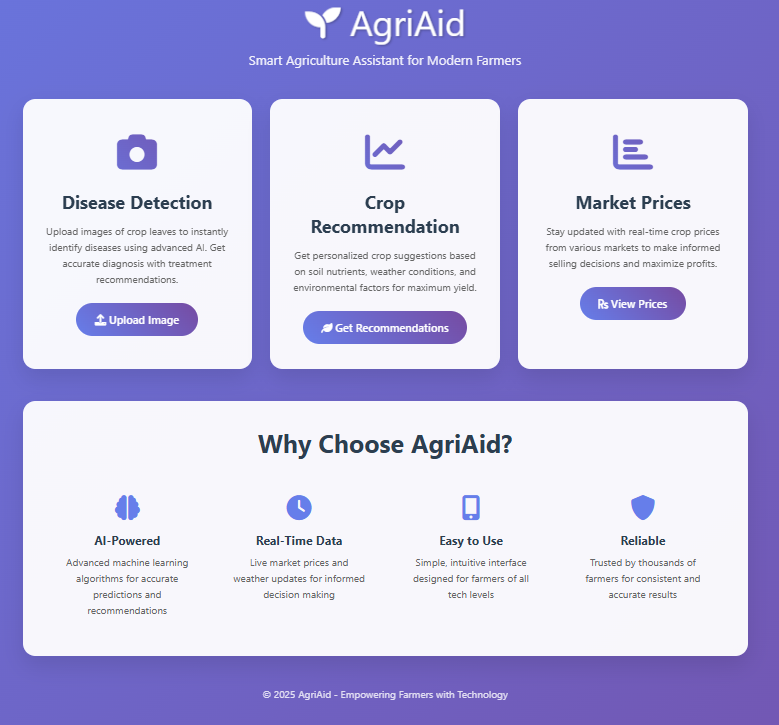

# 🌱 AgriAid - Smart Agriculture Assistant

A comprehensive web-based platform that helps farmers with crop disease detection, crop recommendations, and real-time market prices using AI and machine learning.



## 🎯 Features

### 1. 📸 Disease Detection
- Upload crop leaf images for instant AI-powered disease diagnosis
- Get confidence scores and treatment recommendations
- Supports JPG, PNG, JPEG formats up to 16MB

### 2. 📊 Crop Recommendation
- Get personalized crop suggestions based on soil nutrients (N, P, K)
- Consider environmental factors (temperature, humidity, pH, rainfall)
- AI-powered recommendations with suitability percentages

### 3. 💰 Market Prices
- Real-time crop prices from various markets
- Price trends and market information
- Auto-refresh functionality for latest data

## 🏗️ Project Structure

```
AgriAid/
├── app.py                          # Flask backend server
├── requirements.txt                # Python dependencies
├── setup_project.py               # Project setup script
├── README.md                      # This file
├── templates/                     # HTML templates
│   ├── index.html                 # Home page
│   ├── disease_detection.html     # Disease detection page
│   ├── crop_recommendation.html   # Crop recommendation page
│   └── market_prices.html         # Market prices page
├── static/                        # Static files
│   ├── css/
│   ├── js/
│   └── uploads/                   # Temporary image uploads
├── models/                        # ML models
│   ├── plant_disease_model.h5     # Trained disease detection model
│   ├── class_labels.json          # Disease class labels
│   └── crop_model.pkl             # Crop recommendation model
└── datasets/                      # Training datasets
    └── crop_recommendation.csv    # Crop recommendation data
```

## 🚀 Step-by-Step Implementation

### Step 1: Project Setup

1. **Create project directory:**
   ```bash
   mkdir AgriAid
   cd AgriAid
   ```

2. **Run the setup script:**
   ```bash
   python setup_project.py
   ```

### Step 2: Install Dependencies

```bash
pip install -r requirements.txt
```

### Step 3: Prepare Your Data

#### Disease Detection Dataset
- Ensure your PlantVillage dataset is at: `C:\Users\hvish\Desktop\AGRIAID\PlantVillage`
- Update the path in `app.py` if different:
  ```python
  dataset_path = r"YOUR_PLANTVILLAGE_PATH"
  ```

#### Crop Recommendation Dataset
- Place your `crop_recommendation.csv` in the `datasets/` folder
- Ensure it has columns: `N`, `P`, `K`, `temperature`, `humidity`, `ph`, `rainfall`, `label`

### Step 4: Train the Disease Detection Model

1. **Run your training script** (the code you provided):
   ```bash
   python your_training_script.py
   ```

2. **Verify model files are created:**
   - `models/plant_disease_model.h5`
   - `models/class_labels.json`

### Step 5: Create All Project Files

Create the following files in your project directory:

#### 1. `app.py` (Flask Backend)
- Copy the Flask backend code provided
- This handles all API endpoints and ML model integration

#### 2. HTML Templates (in `templates/` folder)
- `index.html` - Home page with navigation
- `disease_detection.html` - Image upload and analysis
- `crop_recommendation.html` - Soil/weather input form
- `market_prices.html` - Price display with auto-refresh

#### 3. `requirements.txt`
- Lists all Python dependencies

#### 4. `setup_project.py`
- Automated setup script for project structure

### Step 6: Configure the Application

1. **Update dataset paths in `app.py`:**
   ```python
   # Line ~45: Update PlantVillage path
   dataset_path = r"C:\Users\hvish\Desktop\AGRIAID\PlantVillage"
   
   # Line ~180: Update CSV path if needed
   if not os.path.exists('datasets/crop_recommendation.csv'):
   ```

2. **Customize disease treatments** (optional):
   ```python
   # In load_disease_treatments() function
   # Add more disease-treatment mappings
   ```

### Step 7: Run the Application

```bash
python app.py
```

The application will start at: `http://localhost:5000`

## 🔧 Configuration Options

### Disease Detection Model
- **Input size:** 224x224 RGB images
- **Model format:** TensorFlow/Keras H5
- **Supported formats:** JPG, PNG, JPEG
- **Max file size:** 16MB

### Crop Recommendation Model
- **Algorithm:** Random Forest Classifier
- **Features:** N, P, K, temperature, humidity, pH, rainfall
- **Output:** Top 3 crop recommendations with suitability scores

### Market Prices
- **Update frequency:** Every 5 minutes (configurable)
- **Data source:** Mock data (replace with real API)
- **Supported crops:** Wheat, Rice, Tomato, Onion, Potato, etc.

## 🎨 Customization

### Adding New Diseases
1. **Retrain the model** with new disease classes
2. **Update class_labels.json** with new mappings
3. **Add treatment information** in `load_disease_treatments()`

### Adding New Crops
1. **Update crop_recommendation.csv** with new crop data
2. **Retrain the crop model** (happens automatically)
3. **Add crop icons** in market_prices.html if needed

### Integrating Real Market APIs
Replace the mock data in `get_market_prices()`:
```python
def get_market_prices():
    # Replace with real API calls
    # Example: AgMarkNet, mandi board APIs
    response = requests.get("YOUR_MARKET_API_URL")
    return response.json()
```

## 🐛 Troubleshooting

### Common Issues

1. **Model not found error:**
   - Ensure you've trained the disease detection model
   - Check file paths in `load_models()`

2. **CSV not found error:**
   - Place `crop_recommendation.csv` in `datasets/` folder
   - Verify column names match expected format

3. **Image upload fails:**
   - Check file format (JPG, PNG, JPEG only)
   - Ensure file size < 16MB
   - Verify `static/uploads/` directory exists

4. **TensorFlow warnings:**
   - These are normal and can be ignored
   - Warnings are suppressed in the code

### Debug Mode
Enable debug mode for detailed error messages:
```python
app.run(debug=True, host='0.0.0.0', port=5000)
```

## 📱 Browser Compatibility

- **Recommended:** Chrome, Firefox, Safari, Edge
- **Mobile-responsive:** Works on tablets and phones
- **JavaScript required:** For interactive features

## 🔒 Security Considerations

### For Production Deployment:
1. **Change secret key:**
   ```python
   app.secret_key = 'your-secure-random-key'
   ```

2. **Add input validation:**
   - File type verification
   - Size limits
   - Input sanitization

3. **Use HTTPS:**
   - SSL certificates
   - Secure file uploads

4. **Database integration:**
   - Replace mock data with real database
   - User authentication if needed

## 📈 Performance Optimization

### For Large Scale Deployment:
1. **Use production WSGI server:**
   ```bash
   gunicorn -w 4 -b 0.0.0.0:5000 app:app
   ```

2. **Implement caching:**
   - Redis for market prices
   - Model prediction caching

3. **Optimize models:**
   - Model quantization
   - TensorFlow Lite for mobile

4. **Add CDN:**
   - Static file delivery
   - Image optimization

## 🤝 Contributing

1. Fork the repository
2. Create feature branch
3. Make changes
4. Test thoroughly
5. Submit pull request

## 📞 Support

For implementation help:
1. Check this documentation
2. Review error logs
3. Verify all dependencies are installed
4. Ensure data files are in correct locations

## 🎉 Success Checklist

- [ ] Project structure created
- [ ] Dependencies installed
- [ ] Disease detection model trained
- [ ] Crop recommendation dataset available
- [ ] All HTML templates created
- [ ] Flask app runs without errors
- [ ] Can access http://localhost:5000
- [ ] Image upload works
- [ ] Crop recommendations work
- [ ] Market prices display correctly

---

**🌱 Happy Farming with AgriAid! 🚜**
