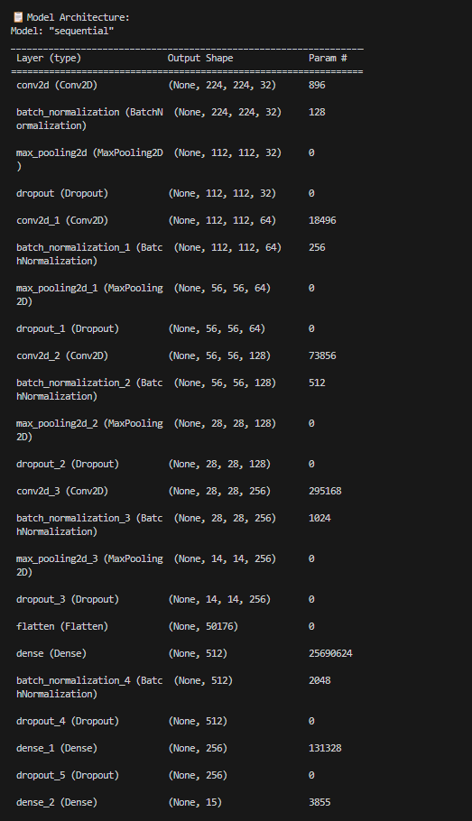
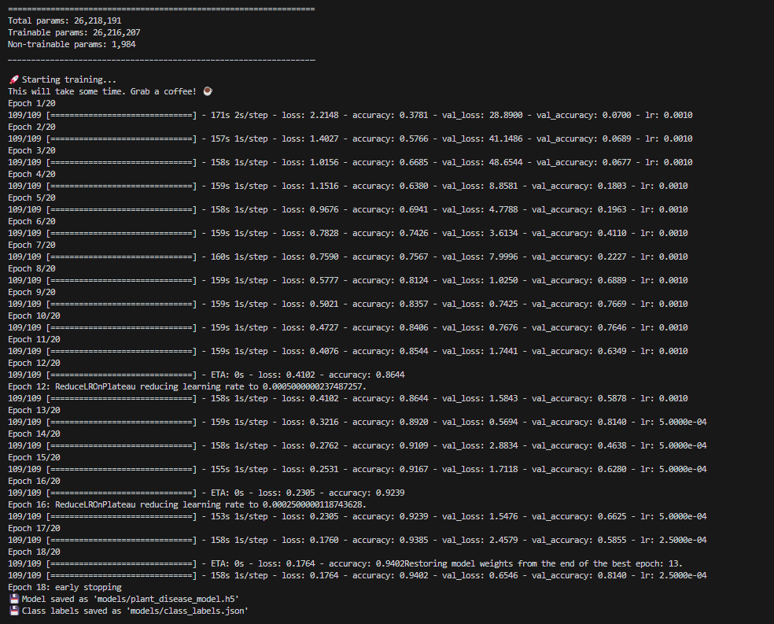
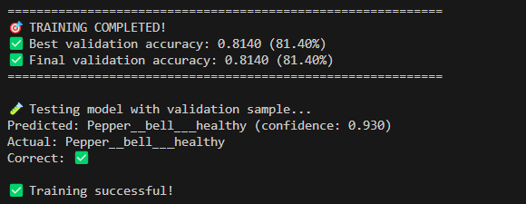

# 🌱 AgriAid - Smart Agriculture Assistant

A comprehensive web-based platform that helps farmers with crop disease detection, crop recommendations, and real-time market prices using AI and machine learning.
<p align="center">
  
</p>


## 🎯 Features

### 1. 📸 Disease Detection
- Upload crop leaf images for instant AI-powered disease diagnosis
- Get confidence scores and treatment recommendations
- Supports JPG, PNG, JPEG formats up to 16MB

### 2. 📊 Crop Recommendation
- Get personalized crop suggestions based on soil nutrients (N, P, K)
- Consider environmental factors (temperature, humidity, pH, rainfall)
- AI-powered recommendations with suitability percentages

### 3. 💰 Market Prices
- Real-time crop prices from various markets
- Price trends and market information
- Auto-refresh functionality for latest data

## 🏗️ Project Structure

```
AgriAid/
├── app.py                          # Flask backend server
├── requirements.txt                # Python dependencies
├── setup_project.py               # Project setup script
├── README.md                      # This file
├── templates/                     # HTML templates
│   ├── index.html                 # Home page
│   ├── disease_detection.html     # Disease detection page
│   ├── crop_recommendation.html   # Crop recommendation page
│   └── market_prices.html         # Market prices page
├── static/                        # Static files
│   ├── css/
│   ├── js/
│   └── uploads/                   # Temporary image uploads
├── models/                        # ML models
│   ├── plant_disease_model.h5     # Trained disease detection model
│   ├── class_labels.json          # Disease class labels
│   └── crop_model.pkl             # Crop recommendation model
└── datasets/                      # Training datasets
    └── crop_recommendation.csv    # Crop recommendation data
```
### Trained model Results
- Model Architecture
<p align="center">
  
</p>
- Training Losses
<p align="center">
  
</p>
- Training Accuracy
<p align="center">
  
</p>


### Run the Application

```bash
python app.py
```

The application will start at: `http://localhost:5000`

## 🔧 Configuration Options

### Disease Detection Model
- **Input size:** 224x224 RGB images
- **Model format:** TensorFlow/Keras H5
- **Supported formats:** JPG, PNG, JPEG
- **Max file size:** 16MB

### Crop Recommendation Model
- **Algorithm:** Random Forest Classifier
- **Features:** N, P, K, temperature, humidity, pH, rainfall
- **Output:** Top 3 crop recommendations with suitability scores

### Market Prices
- **Update frequency:** Every 5 minutes (configurable)
- **Data source:** Mock data (replace with real API)
- **Supported crops:** Wheat, Rice, Tomato, Onion, Potato, etc.

## 🎨 Customization

### Adding New Diseases
1. **Retrain the model** with new disease classes
2. **Update class_labels.json** with new mappings
3. **Add treatment information** in `load_disease_treatments()`

### Adding New Crops
1. **Update crop_recommendation.csv** with new crop data
2. **Retrain the crop model** (happens automatically)
3. **Add crop icons** in market_prices.html if needed

### Integrating Real Market APIs
Replace the mock data in `get_market_prices()`:
```python
def get_market_prices():
    # Replace with real API calls
    # Example: AgMarkNet, mandi board APIs
    response = requests.get("YOUR_MARKET_API_URL")
    return response.json()
```


## 📈 Performance Optimization

### For Large Scale Deployment:
1. **Use production WSGI server:**
   ```bash
   gunicorn -w 4 -b 0.0.0.0:5000 app:app
   ```

2. **Implement caching:**
   - Redis for market prices
   - Model prediction caching

3. **Optimize models:**
   - Model quantization
   - TensorFlow Lite for mobile

4. **Add CDN:**
   - Static file delivery
   - Image optimization

## 🤝 Contributing

1. Fork the repository
2. Create feature branch
3. Make changes
4. Test thoroughly
5. Submit pull request

## 📞 Support

For implementation help:
1. Check this documentation
2. Review error logs
3. Verify all dependencies are installed
4. Ensure data files are in correct locations

## 🎉 Success Checklist

- [ ] Project structure created
- [ ] Dependencies installed
- [ ] Disease detection model trained
- [ ] Crop recommendation dataset available
- [ ] All HTML templates created
- [ ] Flask app runs without errors
- [ ] Can access http://localhost:5000
- [ ] Image upload works
- [ ] Crop recommendations work
- [ ] Market prices display correctly

---

**🌱 Happy Farming with AgriAid! 🚜**
